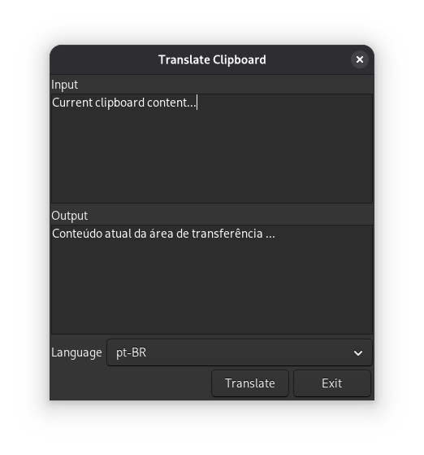

# translate-clipboard

Clipboard translator with yad GUI using translate-shell. A lightweight Bash script that translates clipboard content and allows language selection with persistent preference. Supports editing the text before translation with a simple YAD GUI.

