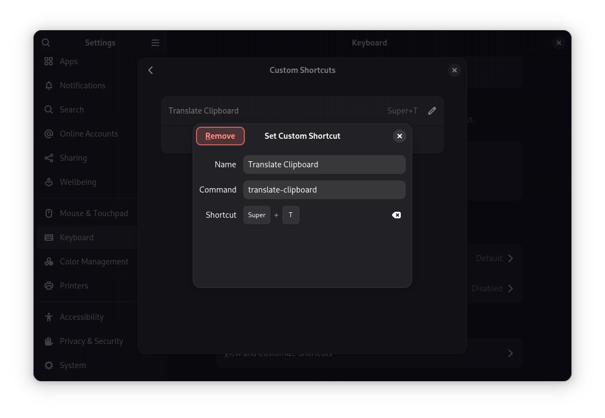

# Translate Clipboard

**Translate Clipboard** is a lightweight Bash script that translates your clipboard content using **translate-shell**, with a simple **YAD GUI**.  It allows you to select target language, edit text before translation, and remembers your language preferences.


## Features

- Translate clipboard content quickly.
- Choose target language.
- Edit text before translation.
- Persistent language preferences.
- Simple, lightweight YAD GUI.

## Installation

Download the package for your system from the [Releases Page](https://github.com/devleonardoamaral/translate-clipboard/releases).  

### On Debian/Ubuntu

Use `apt` to install the package, which automatically handles dependencies:

```bash
# Copy to /tmp to avoid permissions issues
cp ./translate-clipboard_1.0.0_all.deb /tmp/

# Go to temporary directory
cd /tmp

# Install package
sudo apt install ./translate-clipboard_1.0.0_all.deb
````

> Avoid using `dpkg -i` directly, as it does not resolve dependencies automatically.

### On Fedora

Use `dnf` to install the package, which resolves dependencies automatically:

```bash
sudo dnf install ./translate-clipboard-1.0.0-1.noarch.rpm
```

## Post-installation
After installation, optionally configure a shortcut in your desktop environment to run the script quickly.



## Usage

* Copy text to your clipboard.
* Press your configured shortcut (or run `translate-clipboard` from the terminal).
* The YAD window will show the original text and its translation.